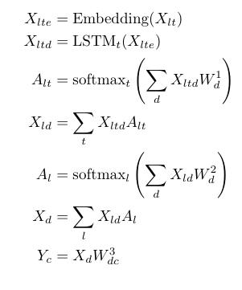

*Native Language Identification* is the challenge of identifying the first language of an author based on texts written in a second language.
The project examines this task with a corpus of [over 18000 AI papers](https://github.com/marekrei/ml_nlp_paper_data).
To ensure that the native language is not indirectly or directly revealed, relevant information is extensively removed from texts. This includes

- author names
- e-mails
- institutions and companies
- countries and nationalities
- acknowledgments and funding
- personal data (e. g. addresses)
- references

# Installation

```
(git lfs pull)
conda env create --file=environment.yml
conda activate nli-env
```

## Run

For training [all papers](https://github.com/marekrei/ml_nlp_paper_data) were downloaded in PDF and converted to text files with the command line application *pdftotext*. There is some [demo data](demodata/).

### Preprocessing

```
clean_text.py [-h] [-d DIRECTORY] [-f FILE] [-p PROCESSES] [-gpu] [-v]

optional arguments:
  -h, --help            show this help message and exit
  -d DIRECTORY, --directory DIRECTORY
                        data directory to process, e.g. data/txts/
  -f FILE, --file FILE  single text file to process, e.g. data/txts/AAAI12-4.txt
  -p PROCESSES, --processes PROCESSES
                        amount of cpu cores used (defaults to all available)
  -gpu                  activate hardware acceleration (each process takes ~700mb GPU memory, take care!)
  -v, --verbose         print additional output (mainly for debugging)
```

### Classification

```
classify.py [-h] [-d DIRECTORY] [-f FILE] [-gpu] [-v]

optional arguments:
  -h, --help            show this help message and exit
  -d DIRECTORY, --directory DIRECTORY
                        data directory to process, e.g. data/txts_cleaned/
  -f FILE, --file FILE  single pdf file to process, e.g. data/txts_cleaned/AAAI12-0.txt
  -gpu                  activate hardware acceleration (this may require up to 16GB of GPU memory, take care!)
  -v, --verbose         print additional output (mainly for debugging)
```

## Example Usage

```
# process every file in data/txts/ cpu-based with all available cores
python clean_text.py -d data/txts/

# process every file in data/txts/ hardware-accelerated with four cores
python clean_text.py -d data/txts/ -p 4 -gpu

# process single file with hardware acceleration
python clean_text.py -f data/txts/AAAI12-4.txt -gpu

# classify single file
python classify.py -f data/txts_cleaned/AAAI12-4.txt

# classify every file in data/txts_cleaned using hardware acceleration
python classify.py -d data/txts_cleaned -gpu
```

## About

Consider following indices

- *l*: amount of lines in the text file of a paper (dynamic)
- *t*: (sub)tokens in each line (shorter lines are padded; also dynamic)
- *e*: embedding dimension (100)
- *d*: hidden dimension (150)
- *c*: amount of classes (12)

The model used for classification can then be described as follows:



Since a one-dimensional weighting of hidden states is learned, it can be visualized how much attention the network pays to each state. This ensures that the network does not use false clues, such as overlooked information to be removed.


If the network learns with uncensored texts, the following happens.


Any information other than email domains, which seem to reveal native languages most reliably, is ignored.

Furthermore, centroids can be calculated from the document vectors Xd for each class. Here blue is USA, red is China and UK is pink.


Since the final document vector Xd is merely a weighted sum of the row vectors Xzd cosine similarity can be used with those centroids to determine for each line which nationality is most probable. 


Here are some examples for lines with high similarity.

- USA:

- China:

- UK:
